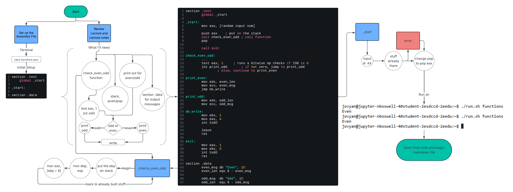

# 6-2/2 Functions Assignment
Nigel Boswell

## Flowchart:



## Challenges encountered:
One challenge similar to before but a bit more challenging here, was getting the eax register to both be a register in use and getting used for printing, thus overriding the values. additionally could not pop the stack back on, post function call, as opposed to when we had the procedure call. had to also get the [ebp + 8] to mkae sure its seperating the arguements from the call register alterations. I remember doing the odd/even testing before so I just did that again here but now with the function calls and jumping around even more.

## Assembly Files:
### functions.asm:
[functions.asm](./functions.asm)
```asm
section .text
        global _start

_start:
	; input num to eax
        mov eax, 44
        
        push eax	; put on the stack
        call check_even_odd	; call function
        pop eax

        call exit	; lets get out of here

; function 
check_even_odd:
        push ebp	; put on stack, 
        mov ebp, esp	; set up the stack

        mov eax, [ebp + 8] 	; retrieve the integer 
        test eax, 1		; runs a bitwise op checks if lSB is 0 
        jnz print_odd		; if not zero, jump to print_odd
				; else, continue to print_even
				
print_even:
        mov edx, even_len
        mov ecx, even_msg
        jmp write

print_odd:
        mov edx, odd_len
        mov ecx, odd_msg

; prints it out all the way
write:
        mov ebx, 1
        mov eax, 4
        int 0x80

        leave
        ret

exit:
        mov eax, 1
        mov ebx, 0
        int 0x80
        ret

section .data
        even_msg db "Even", 10
        even_len equ $ - even_msg

        odd_msg  db "Odd", 10
        odd_len  equ $ - odd_msg

```

### Sources:
Flowchart creation: https://lucid.co/lucidchart
