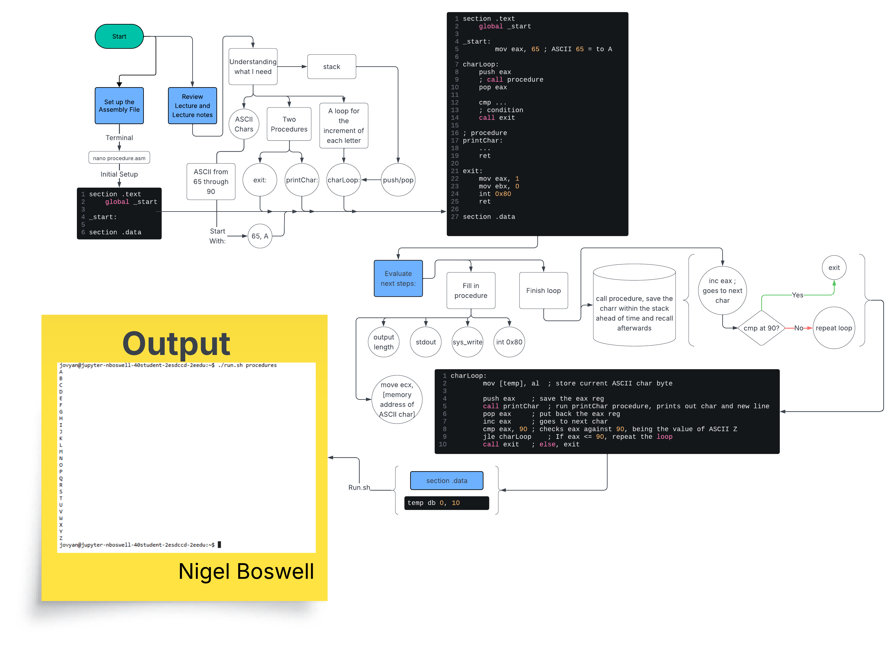

# 6-1/2 Procedures Assignment
Nigel Boswell

## Flowchart:



## Challenges encountered:
An unexpected challenge this time was using lucidchart for the flowchart, apparently I only get so many files and only so many icons + arrows per file. This created a somewhat odd ending to the flowchart since I couldn't fit anymore. Of the actual code, I encounterd the typical typo errors and mostly struggled with what I was supposed to use the push/pop on the stack for, figured it held the current reg during the print call. after some unsuccesful testing I realized that I needed antoher variable to hold the current ascii char memory specifically for the ecx to have during the print call. I think this assignment was a good use of everything we've used to far. 


## Assebly Files:
### procedures.asm:
[procedures.asm](./procedures.asm)
```asm
section .text
        global _start

_start:
        mov eax, 65	; ASCII 65 = to A, start here

charLoop:
        mov [temp], al 	; store current ASCII char byte
        
        push eax	; save the eax reg
        call printChar	; run printChar procedure, prints out char and new line
        pop eax		; put back the eax reg

        inc eax		; goes to next char
        cmp eax, 90	; checks eax against 90, being the value of ASCII Z
        jle charLoop	; If eax <= 90, repeat the loop

        call exit	; else, exit

; The procedure, should print out the char followed by a new line
printChar:
        mov edx,2	; output length = 2 bytes, 1 for char, 1 for new line
        mov ecx, temp	; mem address of the temp
        mov ebx, 1	; stdout
        mov eax, 4	; system call (sys_write)
        int 0x80	; call the kernal
        ret

; exit is now a procedure that we can call
exit:
        mov eax, 1
	      mov ebx, 0
        int 0x80
        ret

section .data
	; 1st byte is 0 (this will hold the char)
	; 2nd byte is 10 (for next line)
	temp db 0, 10
```

### Sources:
FLowchart creation: https://lucid.co/lucidchart
